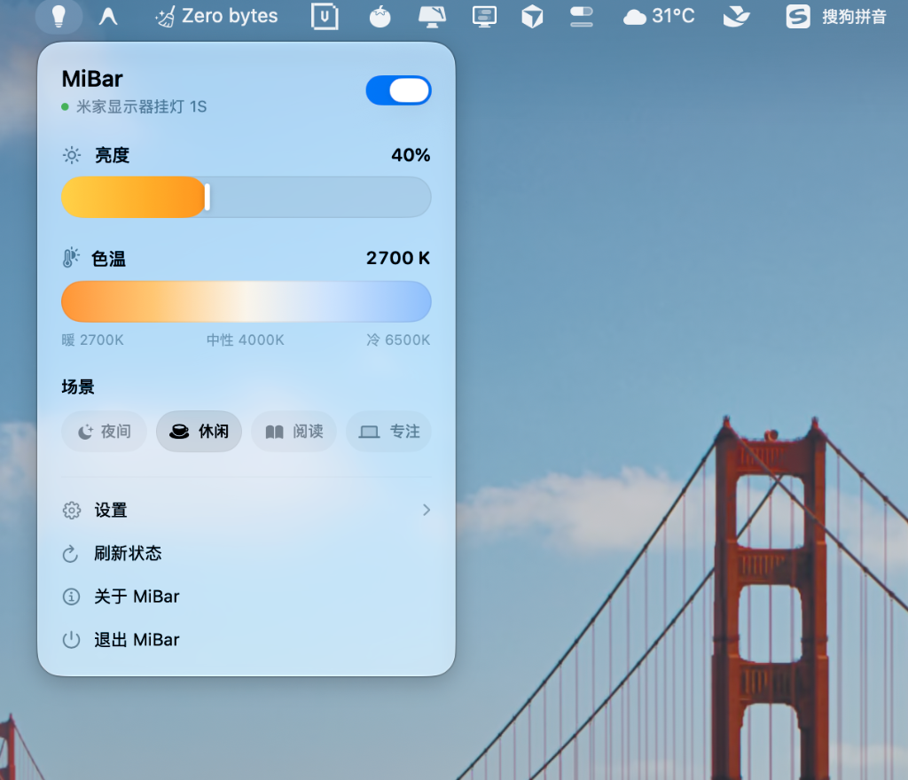

# MiBar 💡

<p align="center">
  <strong>专为 macOS 设计的米家智能显示器挂灯 1S 菜单栏控制工具</strong>
</p>

<p align="center">
  <a href="https://mibar.pages.dev/"></a>
  
  
  
  
</p>

<p align="center">
  
</p>

---

**MiBar** 是一款轻量、优雅的 macOS 菜单栏应用，让你可以直接在 Mac 菜单栏中无缝调节**米家智能显示器挂灯 1S**（型号：`yeelink.light.lamp22`）的开关、亮度、色温以及预设情景模式。

- 🌐 **官方主页**：[https://mibar.pages.dev/](https://mibar.pages.dev/)
- 📦 **最新发布**：[GitHub Releases](https://github.com/extrastu/MiBar/releases)

无需每次打开手机 App 或使用物理旋钮，随时在桌面即可完成灯光调控。

---

## ✨ 核心特性

- 🖥️ **纯正原生体验**：常驻 macOS 菜单栏，采用原生毛玻璃材质与丝滑弹簧动效，轻巧无感。
- ⚡ **局域网直连控制（miIO）**：基于 local UDP 加密通信，低延迟秒级响应，无需依赖外网中转。
- 🎛️ **细腻调节体验**：
  - **开关控制**：一键点亮或熄灭挂灯。
  - **无级亮度调节**：1% ~ 100% 胶囊滑块平滑调节，支持滚轮/拖拽与快捷预设。
  - **色温微调**：2700K 暖黄光到 6500K 冷白光自然渐变。
  - **常用情景预设**：一键切换专注、阅读、影音、休闲等模式。
- 📲 **米家扫码快速配对**：
  - 支持米家账号二维码扫码登录，一键获取局域网内挂灯 IP 与 Token，免去繁琐抓包步骤。
  - 临时会话，不保留账号密码，仅在内存中解析设备列表。
- 🔒 **安全隐私**：
  - 设备 Token 采用系统级 macOS 钥匙串（Keychain）安全隔离存储。
  - 局域网本地直连，数据不上报。
- 🛠️ **现代 Swift 架构**：
  - 纯 SwiftUI + Observation (`@Observable`) 数据流。
  - Swift Concurrency 严格并发安全（`Sendable`、`Actor`、`nonisolated`）。

---

## 🛠️ 支持设备

| 设备型号                  | 型号标识 (Model Identifier) | 连接方式                |
| :------------------------ | :-------------------------- | :---------------------- |
| **米家智能显示器挂灯 1S** | `yeelink.light.lamp22`      | 局域网 miIO (UDP 54321) |

---

## 🚀 快速上手

### 1. 扫码一键配置（推荐）

1. 启动 **MiBar**，点击菜单栏图标打开配置面板。
2. 选择 **「米家扫码登录」**，使用手机「米家 App」或「微信」扫描生成的登录二维码。
3. 授权确认后，MiBar 会自动检索名下的挂灯设备，并自动填入局域网 IP 与 32 位 Token。
4. 点击保存，即可开始畅快控制！

### 2. 手动填写配置

如果你已有通过抓包或网关获取的设备 IP 和 Token：

1. 打开配置页面，在输入框中填入：
   - **设备 IP**：挂灯在当前局域网分配的 IPv4 地址（如 `192.168.1.100`）。
   - **设备 Token**：32 位十六进制字符串（由 16 字节密钥转换而来）。
2. 点击 **「保存并连接」** 即可。

---

## 🏗️ 架构设计与代码组织

```
MiBar/
├── App/
│   └── MiBarApp.swift               # 应用程序入口，配置 MenuBarExtra
├── Models/
│   ├── LightModels.swift            # 挂灯状态与 MIoT 属性数据模型
│   └── XiaomiCloudModels.swift      # 小米云扫码与设备列表模型
├── Services/
│   ├── Cloud/
│   │   ├── XiaomiCloudClient.swift  # 小米云扫码、轮询认证与设备拉取
│   │   └── XiaomiCloudCrypto.swift  # 小米云协议加密与签名
│   ├── MiIO/
│   │   ├── MiIOClient.swift         # miIO 协议客户端，负责局域网握手与请求
│   │   ├── MiIOCrypto.swift         # AES-128-CBC 与 MD5 报文加解密
│   │   ├── MiIOPacket.swift         # miIO 报文帧编解码
│   │   └── DatagramTransport.swift  # 基于 Network.framework 的 UDP 通信层
│   └── Storage/
│       └── KeychainStore.swift      # 基于 macOS Keychain 的安全 Token 存储
├── Store/
│   └── LightStore.swift             # 全局状态管理，串联 UI、本地 miIO 与云端登录
├── Views/
│   ├── LightMenuView.swift          # 菜单栏主弹窗视图与配置页
│   ├── Components/
│   │   ├── LightControlCapsuleSlider.swift # 自定义触控胶囊滑块
│   │   └── LightPresetsView.swift   # 情景预设快捷视图
│   └── MenuBar/
│       ├── AboutModal.swift         # 关于 MiBar 弹窗视图
│       ├── MenuBarModal.swift       # 菜单内嵌确认弹窗
│       └── MenuBarWindowSizing.swift# 自适应窗口尺寸与毛玻璃适配
└── Utilities/
    └── DataExtensions.swift         # Hex、Data 扩展工具函数
```

---

## 💻 编译与开发

### 环境要求

- **macOS**：macOS 14.0 (Sonoma) 及以上
- **Xcode**：Xcode 15.0+ 或 16.0+
- **Swift**：Swift 6.0

### 构建步骤

```bash
# 克隆仓库
git clone https://github.com/extrastu/MiBar.git
cd MiBar

# 使用 Xcode 打开工程
open MiBar.xcodeproj
```

在 Xcode 中选择 `My Mac` 作为目标平台，按下 `Cmd + R` 即可构建并运行。

### 打包与公证

项目提供了全自动的编译、Hardened Runtime 签名、DMG/ZIP 制作与 Apple 公证脚本：

```bash
# 1. 仅本地打包（跳过公证）
./scripts/package.sh --skip-notarize

# 2. 完整签名、打包并提交 Apple 官方公证（使用保存在 Keychain 的凭据 Profile）
./scripts/package.sh --profile "your-notary-profile"

# 3. 指定输出格式（dmg / zip / all）
./scripts/package.sh --format dmg --skip-notarize
```

打包产物将自动输出至 `./dist` 目录，命名遵循 `<AppName>-<Version>.<ext>`（如 `MiBar-1.0.dmg`、`MiBar-1.0.zip`）。

---

## 🌐 官方网站

欢迎访问 MiBar 官方主页：**[https://mibar.pages.dev/](https://mibar.pages.dev/)**

- 💡 **在线功能特性演示**：直观了解 UI 设计、滑动微调动效与情景模式。
- 📖 **配对与常见问题（FAQ）**：详细的扫码配对排查指引与 miIO 协议说明。
- 📦 **快速下载**：一键获取适用于 macOS 的最新 DMG 安装镜像。

---

## 📜 许可证

本项目采用 [MIT License](LICENSE) 开源许可证，仅用于学习和技术交流。
